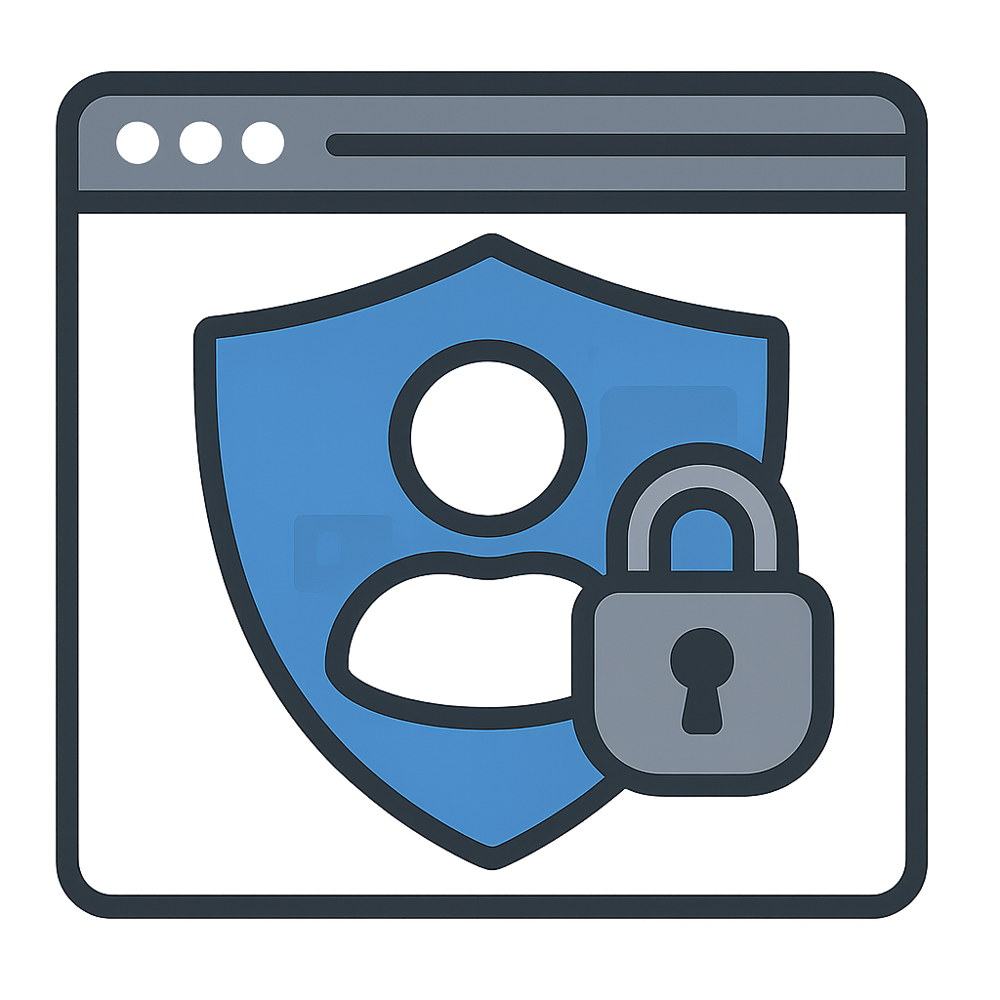

# 🔒 Secure Profile Lock - Chrome Extension

[](https://chrome.google.com/webstore/detail/browser-profiles-authenti/aonieimkkkiknekpipfblglanjganbol)
[](https://github.com/AristarhUcolov/Browser-Profiles-Authentication-Secure-Profile-Lock/blob/main/LICENSE)


<div align="center">
  
  <p><em>Password protection for browser profiles - Keep your browsing private and secure</em></p>
</div>

---

## 📖 Overview

**Secure Profile Lock** is a powerful Chrome extension that adds password protection to your browser profiles. Whether you share your computer with family members, work in a public space, or simply want to keep your browsing data secure, this extension provides robust profile-level authentication.

Every time your browser restarts or when someone tries to access your protected profile, they'll need to enter the correct password. All data is stored locally on your device - no servers, no cloud, no tracking.

## 🌟 Key Features

- 🔐 **Password-protected profiles** - Secure your Chrome profile with a custom password
- 🔄 **Auto-lock on restart** - Profile automatically locks when browser closes
- 🌐 **Universal coverage** - Works on all websites and tabs (except Chrome internal pages)
- 🏠 **100% local storage** - Zero data collection, everything stays on your device
- 🛡️ **Tamper-proof design** - Prevents bypassing through extension disabling
- 💡 **Password hints** - Optional hints to help you remember your password
- ⚡ **Lightweight & fast** - Minimal performance impact
- 🎨 **Clean interface** - Simple, intuitive password setup and unlock screens

## 🚀 Installation

### Option 1: Chrome Web Store (Recommended)

1. Visit the [Chrome Web Store page](https://chrome.google.com/webstore/detail/browser-profiles-authenti/aonieimkkkiknekpipfblglanjganbol)
2. Click **"Add to Chrome"**
3. Click **"Add extension"** in the confirmation dialog
4. Set up your password when prompted

### Option 2: Manual Installation (For Development)

1. **Clone the repository:**
   ```bash
   git clone https://github.com/AristarhUcolov/Browser-Profiles-Authentication-Secure-Profile-Lock.git
   cd Browser-Profiles-Authentication-Secure-Profile-Lock
   ```

2. **Load the extension in Chrome:**
   - Open Chrome and navigate to `chrome://extensions/`
   - Enable **"Developer mode"** (toggle in top-right corner)
   - Click **"Load unpacked"**
   - Select the cloned repository folder

3. **Set up your password:**
   - The extension will automatically open the password setup page
   - Create a strong password (minimum 8 characters)
   - Optionally add a password hint

## 📱 How to Use

### First-Time Setup

1. After installation, the extension automatically opens the **Password Setup** page
2. Enter your desired password (minimum 8 characters)
3. Confirm your password
4. (Optional) Add a password hint to help you remember
5. Click **"Save Password"**
6. Your profile is now protected!

### Daily Use

- **Locking:** Your profile locks automatically when you close and reopen Chrome
- **Unlocking:** Enter your password when the unlock screen appears
- **Normal browsing:** Once unlocked, browse normally until you close Chrome

### Password Management

To change or reset your password:
1. Navigate to `chrome://extensions/`
2. Find "Browser Profiles Authentication - Secure Profile Lock"
3. Click **"Remove"** to uninstall the extension (this clears stored password)
4. Reinstall and set up a new password

> ⚠️ **Important:** There is no password recovery mechanism. If you forget your password, you'll need to remove and reinstall the extension, which will require setting up a new password.

## 🛠️ How It Works

The extension uses Chrome's Manifest V3 architecture with the following components:

### Technical Architecture

```
┌─────────────────────────────────────────┐
│   Background Service Worker             │
│   (base_script/background.js)           │
│   - Password management                 │
│   - Lock/unlock state control           │
│   - Tab navigation interception         │
└─────────────┬───────────────────────────┘
              │
              ├──► Local Storage (chrome.storage.local)
              │    └─ Password (unencrypted)
              │    └─ Lock state
              │    └─ Password hint
              │
              ├──► Content Scripts (scripts/content.js)
              │    └─ Injected into all tabs
              │    └─ Enforces lock screen
              │
              └──► UI Pages
                   ├─ password-setup.html (Setup)
                   └─ unlock.html (Unlock screen)
```

### Security Model

- **Password Storage:** Passwords are stored directly in Chrome's local storage API without additional encryption or hashing. While Chrome provides some OS-level protections for stored data (e.g., DPAPI on Windows, Keychain on macOS), the extension stores passwords in a retrievable format. Future versions could implement client-side hashing for enhanced security.
- **Lock Enforcement:** Content scripts prevent page access until authentication
- **Navigation Control:** Web navigation API intercepts all page loads when locked
- **Tamper Protection:** Extension is designed to resist tampering when profile is locked

## 🔒 Security Considerations

### Current Security Features
- ✅ Local-only storage (no network transmission)
- ✅ Profile-level protection
- ✅ Auto-lock on browser restart
- ✅ Universal website coverage

### Security Limitations
- ⚠️ Passwords are stored in Chrome's local storage without hashing or additional encryption
- ⚠️ No password recovery mechanism (by design for security)
- ⚠️ Cannot protect Chrome internal pages (chrome://)
- ⚠️ Users with access to Chrome's developer tools or file system could potentially retrieve stored passwords
- ⚠️ Provides protection against casual access but not against determined technical users

### Recommendations for Enhanced Security
- Use a strong, unique password (12+ characters with mixed case, numbers, symbols)
- Don't share your password
- Consider using a password manager to store your profile password
- For maximum security, also use your OS-level account password protection

## 🗂️ Project Structure

```
Browser-Profiles-Authentication-Secure-Profile-Lock/
├── base_script/
│   └── background.js         # Service worker - core logic
├── html/
│   ├── password-setup.html   # Initial password setup page
│   └── unlock.html           # Profile unlock page
├── images/
│   └── icon.png              # Extension icon
├── scripts/
│   ├── content.js            # Content script injected into pages
│   ├── password-setup.js     # Password setup logic
│   └── unlock.js             # Unlock screen logic
├── styles/
│   └── styles.css            # UI styling
├── manifest.json             # Extension manifest (Manifest V3)
├── LICENSE                   # GNU GPL v3 License
└── README.md                 # This file
```

## 🤝 Contributing

Contributions are welcome! Here's how you can help:

1. **Fork the repository**
2. **Create a feature branch:** `git checkout -b feature/AmazingFeature`
3. **Make your changes** and test thoroughly
4. **Commit your changes:** `git commit -m 'Add some AmazingFeature'`
5. **Push to the branch:** `git push origin feature/AmazingFeature`
6. **Open a Pull Request**

### Development Guidelines
- Follow existing code style and structure
- Test all changes in Chrome before submitting
- Update documentation for new features
- Ensure no breaking changes to existing functionality

## ❓ FAQ & Troubleshooting

### Q: I forgot my password. How can I recover it?
**A:** There is no password recovery mechanism by design (for security). You'll need to remove and reinstall the extension, which will allow you to set a new password.

### Q: Can I use this on multiple profiles?
**A:** Yes! Each Chrome profile can have its own separate password. Install the extension on each profile you want to protect.

### Q: Does this work on Firefox or other browsers?
**A:** Currently, this is designed specifically for Chrome and Chromium-based browsers. Firefox support would require adaptation to Firefox's extension API.

### Q: The extension isn't locking my profile. What's wrong?
**A:** Make sure:
- The extension is enabled (`chrome://extensions/`)
- You've completed the initial password setup
- You've fully closed and reopened Chrome (not just closing windows)

### Q: Can I disable the extension temporarily?
**A:** For security reasons, the extension is designed to resist tampering. To remove protection, you need to uninstall it completely.

### Q: Is my password encrypted?
**A:** Currently, passwords are stored in Chrome's local storage without encryption or hashing. While your password never leaves your device and the extension provides protection against casual access, it's not encrypted at rest. This extension is designed for convenience and basic privacy protection, not for high-security scenarios.

## 📄 License

This project is licensed under the **GNU General Public License v3.0** - see the [LICENSE](LICENSE) file for details.

## 👨‍💻 Author

**Aristarh Ucolov**
- GitHub: [@AristarhUcolov](https://github.com/AristarhUcolov/)
- Email: aristarh.ucolov@gmail.com

## 🙏 Acknowledgments

- Inspired by the need for simple, effective profile protection
- Built with Chrome Extension Manifest V3
- Thanks to the Chrome Extensions community

---

<div align="center">
  <p>If you find this extension useful, please consider giving it a ⭐ on GitHub!</p>
  <p>Made with ❤️ by <a href="https://github.com/AristarhUcolov/">Aristarh Ucolov</a></p>
</div>
